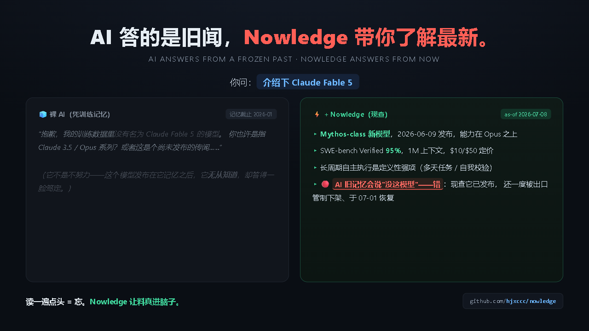

# Nowledge

> # **AI 答的是旧闻，Nowledge 带你了解最新。**
> **AI answers from a frozen past. Nowledge answers from now.**



你问 AI 一个新东西，它可能依赖训练时已有的信息；面对刚发布的版本、工具和争议，这些信息很容易过期。

**Nowledge 干一件事：现查现答，然后标红「AI 旧记忆在这会答错」。**

```
你：介绍下 Claude Fable 5
🧊 裸 AI：       我训练数据里没有这个模型……（它真的不知道，因为发布在它记忆之后）
⚡ +Nowledge：  Fable 5 = Mythos-class 新模型，2026-06-09 发布，SWE-bench 95%，
               🔴 注意：AI 旧记忆会说"没这模型"——错，现查它已发布并一度被出口管制下架又恢复。
```

装进 Claude Code、Codex 或支持同类 `SKILL.md` 约定的 agent。核心脚本**零必需 API Key，纯 Python 标准库**；实时来源的可用性取决于网络与平台限制。

<details>
<summary>它其实还能做另外三件事（点开）——但你只需记住上面那一件</summary>

| 意图 | 你怎么说 | 它给你什么 |
|---|---|---|
| **发现** | "这月 github 前 5 hot 项目" | 现查榜单 + 一张深色榜单卡片 HTML |
| **深学** | "带我系统学 RAG" | 接地三角源 → 路线图/图解/可跑练习/**间隔复训队列**/讲给 AI 听 |
| **追踪** | "追踪 MCP 最新动态" | 只报上次之后的新增（带日期 delta），可配 Cron |

边界：能一句话答的**静态事实**（哪年发布）不走它、直接搜。
</details>

---

## 别人怎么装（Install）

**前置**：① Claude Code、Codex 或支持 `SKILL.md` 的 agent；② Python 3.8+（脚本**零 pip 依赖**）；③ 联网。

**一键安装（推荐）**：
```bash
# macOS / Linux / Git-Bash
curl -fsSL https://raw.githubusercontent.com/hjxccc/nowledge/main/install.sh | bash

# Windows PowerShell
irm https://raw.githubusercontent.com/hjxccc/nowledge/main/install.ps1 | iex
```

默认安装到 Claude Code。安装到其他约定目录：

```bash
# macOS / Linux / Git-Bash：claude（默认）/ codex / agents
curl -fsSL https://raw.githubusercontent.com/hjxccc/nowledge/main/install.sh | NOWLEDGE_TARGET=codex bash

# Windows PowerShell
$env:NOWLEDGE_TARGET="codex"; irm https://raw.githubusercontent.com/hjxccc/nowledge/main/install.ps1 | iex
```

也可用 `NOWLEDGE_DIR` 指定任意绝对目录，它的优先级高于 `NOWLEDGE_TARGET`。装好后重启或让 agent 重新扫描 Skills。

**手动装**：clone 到 `~/.claude/skills/nowledge`、`~/.codex/skills/nowledge` 或 `~/.agents/skills/nowledge`；项目级目录是否生效取决于具体 runtime。

**可选增强**（不装也能用核心）：
- `export GITHUB_TOKEN=xxx` —— 发现模式提高 GitHub 限额（匿名 60 次/时）。
- [Agent-Reach](https://github.com/Panniantong/Agent-Reach) / `twitter-cli` —— 已认证时让 X 源优先做 Latest 关键词真搜索；未安装、未登录或搜索失败会自动退回免登录 syndication。
- `web-access` skill + 一个 Chromium 浏览器 —— 只为微信/知乎的 CDP 兜底；核心 T0 源（HN/arXiv/GitHub/context7/掘金）不需要它。

---

## 用法（Usage）

**日常：说人话**——触发词见 `SKILL.md` 的 description。装好后无需碰命令行。

**手动跑引擎**（想直接用判断层时）：
```bash
python scripts/ground.py "RAG 检索增强" --quick        # 快答：秒级出新鲜料
python scripts/ground.py "loop engineering"            # 深学接地：planner 自动选源
python scripts/discover.py --since month --limit 5 --out hot.html   # 发现：本月热榜+卡片
python scripts/track.py "MCP" --dir mcp-track          # 追踪：出 delta digest
python scripts/review.py due --file <主题>-nowledge/progress.json   # 复训：到期回考
python scripts/gate.py <主题>-nowledge                 # 质量 gate：逐件过合格线
```

产物落当前目录 `./<主题>-nowledge/`。

---

## 两条护城河（在组合与形态，不在单件功能）

1. **形态**：多件套一次打包成"本地可动手的学习套件文件夹"——离线、最小、可动手、理论驱动。竞品要么在线站（roadmap.sh）、要么对话辅导、要么单张绘图。
2. **判断层**：面向**学习材料**的、开源可复现的选材引擎（加权 RRF + 实体聚类 MMR + URL 去重 + 角色三角）。aihot 证明"判断比抓取值钱"但它是新闻场景且评分不开源——这块是真空。

> 核心理念：last30days/aihot 把料端给你就结束了，而"读一遍点头 = 流畅性错觉"。**Nowledge 接着逼你把料变成脑子里的东西。**

---

## 结构

```
SKILL.md            主编排（四意图触发词 + 主流程 + 防卸载硬规则 + 失败模式表）
DESIGN.md           设计蓝图（改设计先改这里）
references/         source-registry · judgment-pipeline · learning-science · mayer-checklist
templates/          diagram-dark.html(静态) · diagram-interactive.html(可拖动交互) · ROADMAP.md · checkpoint.md · rank-card.html
scripts/
  ground.py         第0件接地引擎（--quick 快答 / 缺原理自动 context7 兜底）
  discover.py       发现模式（github trending + 榜单卡片）
  track.py          追踪模式（delta digest）
  review.py         间隔复训引擎（1/3/7/16/35 天）
  gate.py           六件套质量 gate（含反 slop 硬验）
  lib/              planner · fusion(RRF) · cluster(MMR) · dedupe · common
  lib/sources/      hackernews · github · arxiv · reddit · juejin · wechat · zhihu · context7 · x(syndication)
examples/
  loop-engineering-nowledge/   完整深学包样板（六件套 + 接地，过 gate）
  hermes-nowledge/             框架原理·深色架构图解样板
  showcase/                    快答/发现/追踪 三种意图的橱窗样例
```

---

## 现状（2026-07-15）

当前为 **beta**。深学闭环和四种意图已提供可运行实现；确定性核心由单元测试覆盖，示例包通过质量 gate。HN、GitHub、arXiv、掘金、公众号、context7 与 X 都做过作者环境实测，但实时来源会受登录态、反爬、限流和网络影响。

X 源优先使用已认证的 `twitter-cli` 做 Latest 关键词搜索；未安装、未登录或失败时，仅降级到官方 syndication 的固定账号公开时间线，因此**免登录降级不等于全站 X 搜索**。公开发布前仍会继续补充真实主题评测集与跨平台安装验证。
